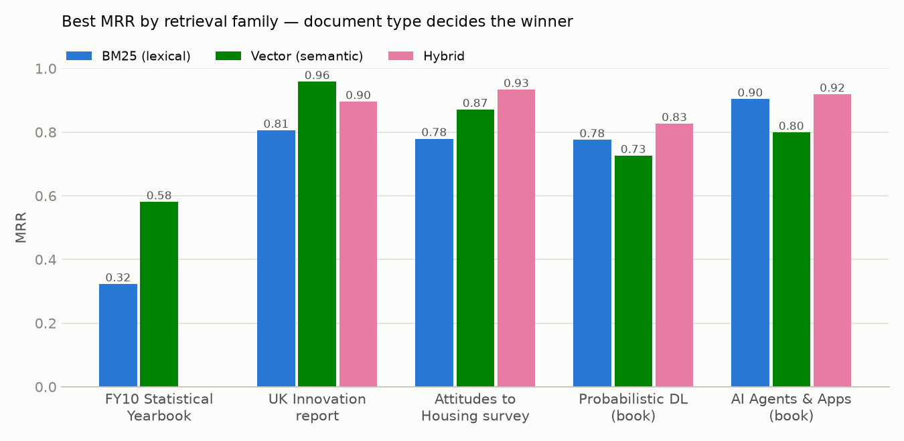
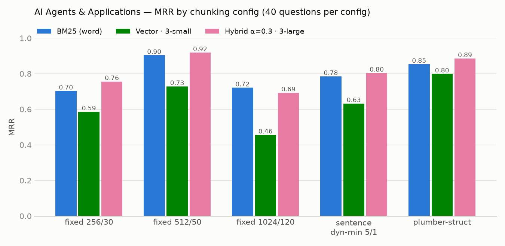
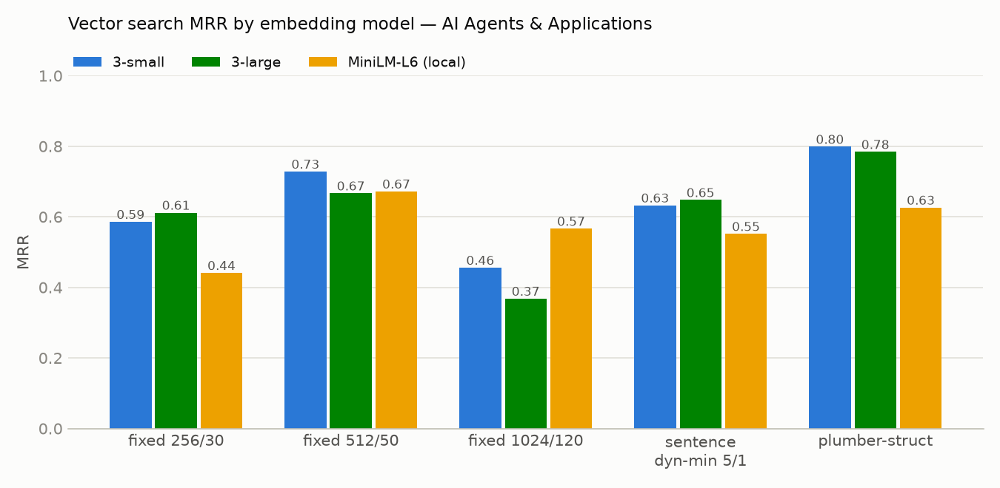
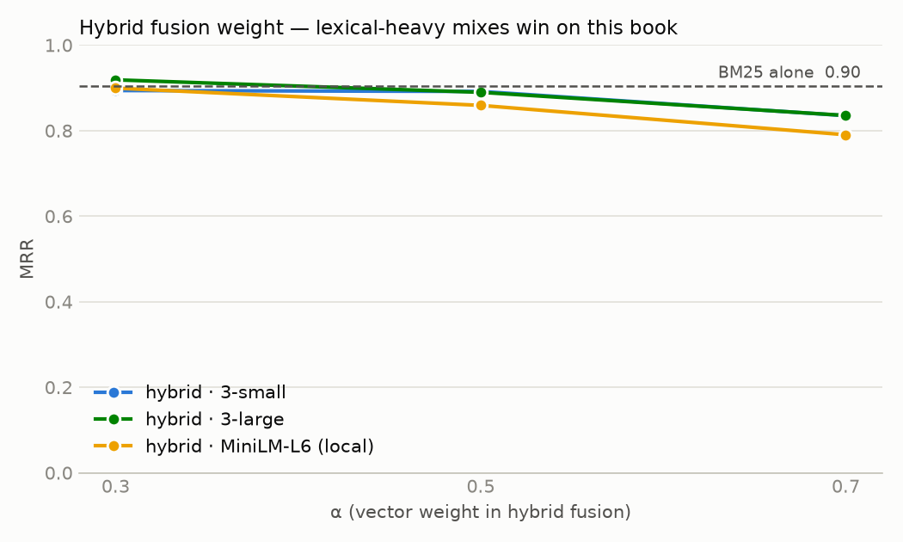
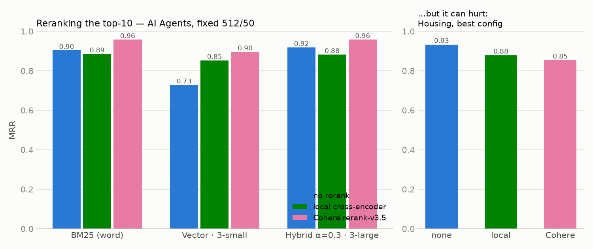
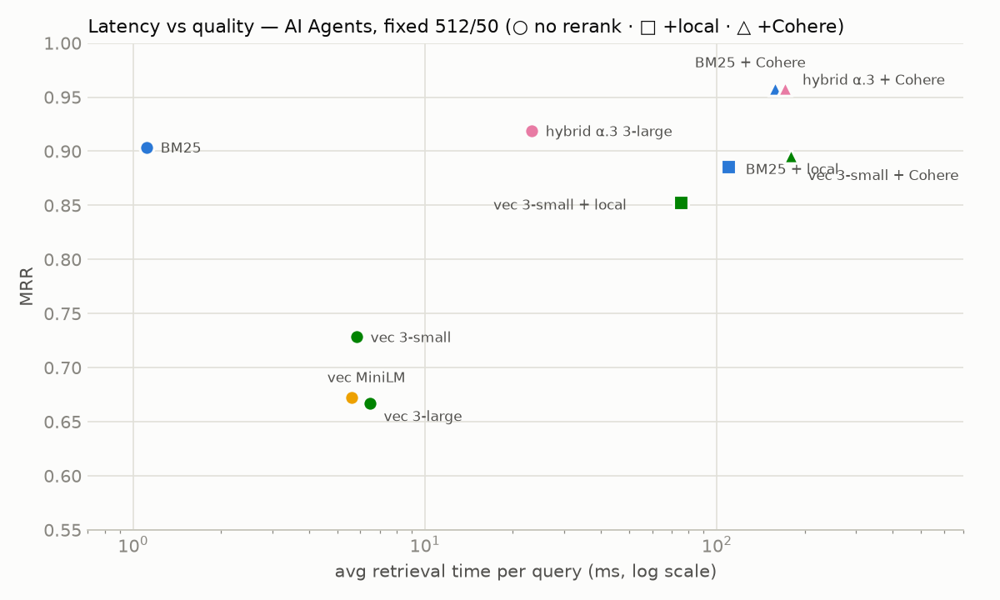
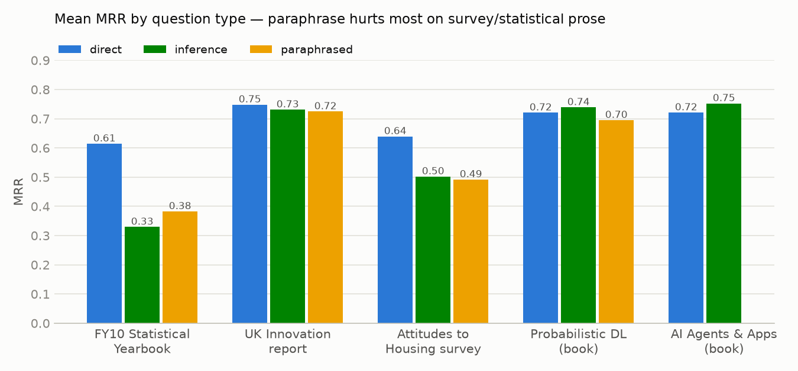

# RAG Pipeline Evaluation — Results & Conclusions

This document draws conclusions from the full experiment history of this project: **~440 evaluated
experiments across 5 PDF documents**, sweeping chunking strategy, embedding model, vector store,
retrieval method, hybrid fusion weight, BM25 tokenizer, and reranking provider. All numbers come
from the eval JSON artifacts under `data/` (each experiment's per-question results are preserved
there); the charts referenced below live in [visualizations/20260725_results_writeup/](visualizations/20260725_results_writeup/).

Evaluation methodology in one paragraph: every chunking configuration gets its **own** synthetic QA
dataset (gpt-4.1-mini, Instructor-validated, 20 sampled chunks × 2–3 question types), so ground-truth
chunk IDs always match the configuration under test. Each question has exactly one gold chunk, so
Precision@K is capped at 1/K and MRR / Recall@K / NDCG@K are the meaningful metrics. Project targets:
**MRR ≥ 0.85, Recall@5 ≥ 0.90**.

## The documents

| Document | Type | Pages | Character |
|---|---|---|---|
| FY10 Statistical Yearbook (`fy10syb`) | statistical yearbook | 119 | early baseline runs only |
| UK Knowledge & Innovation Analysis | government statistical report | 29 | prose + open-style (unruled) tables |
| Attitudes to Housing | survey report | 180 | prose + hundreds of survey tables |
| Probabilistic Deep Learning | technical book | 297 | math/code-heavy prose |
| AI Agents and Applications | technical book | 450 | API/code-heavy prose, largest grids (156 + 91 experiments) |

## Headline results

| Document | Best configuration | MRR | R@5 | Targets met |
|---|---|---|---|---|
| AI Agents & Apps | fixed 512/50 · hybrid α=0.3 · 3-large + **Cohere rerank** | **0.958** | **1.000** | ✅ |
| AI Agents & Apps (no rerank) | fixed 512/50 · hybrid α=0.3 · 3-large | 0.919 | 1.000 | ✅ |
| UK Innovation report | plumber-struct · vector · 3-small | 0.958 | 1.000 | ✅ (n=12) |
| Attitudes to Housing | plumber-struct · hybrid α=0.5 · 3-large | 0.933 | 1.000 | ✅ |
| Probabilistic DL | fixed 512/100 · hybrid α=0.7 · bge-base + **Cohere rerank** | 0.900 | 0.950 | ✅ |
| FY10 Yearbook | fixed 200/20 · vector · 3-large | 0.581 | 0.700 | ❌ (early run) |

Four of five documents clear both targets. The FY10 yearbook was only used in the very first runs
(tiny 100–256-char chunks — those pre-date token-based sizing — plus v1 QA prompts that produced
unanswerable questions) and was retired; its
row is kept as the "before" picture of what the later methodology fixes bought.

---

## Finding 1 — Document type decides BM25 vs. embeddings

The single strongest pattern in the data: **which retrieval family wins is a property of the
document, not of the method.**

- **Technical books → BM25 wins.** On *AI Agents & Apps*, BM25 beats every embedding model tested
  (0.90 vs. 0.80 best-vector); on *Probabilistic DL* it edges them (0.78 vs. 0.73). Questions about
  technical material naturally reuse the book's exact, stable terminology (`create_react_agent`,
  "aleatoric uncertainty", "PixelCNN") — a keyword matcher gets those for free, and embeddings gain
  nothing from paraphrase tolerance that isn't needed.
- **Statistical/survey reports → embeddings win.** UK Innovation: vector 0.96 vs. BM25 0.81; Housing:
  0.87 vs. 0.78; FY10: 0.58 vs. 0.32. Report prose gets paraphrased in questions ("proportion of
  people content" vs. "% satisfied"), and near-identical survey tables differ only by numbers that
  the question text never contains — exact-term matching has nothing to grip.

Practical rule from this data: **look at your corpus before picking a retriever.** If user queries
will echo the document's own vocabulary, BM25 is a ~1 ms/query baseline that embeddings may not beat.

## Finding 2 — There is an ideal chunk size, and bigger is not better

On the largest controlled grid (AI Agents, 40 questions per config, all else held fixed):

| Chunking (tokens/overlap) | # chunks | BM25 | Vector 3-small | Hybrid α=0.3 3-large |
|---|---|---|---|---|
| fixed 256/30 | 928 | 0.70 | 0.59 | 0.76 |
| **fixed 512/50** | 454 | **0.90** | **0.73** | **0.92** |
| fixed 1024/120 | 232 | 0.72 | 0.46 | 0.69 |

- **512 tokens was the sweet spot** on both technical books (PDL's best config is also 512-token).
- **1024-token chunks lose everywhere, and worst for embeddings** (vector drops to 0.46): a single
  vector averaging several concepts matches none of them well. BM25 degrades more gracefully —
  term frequency still works in a long chunk.
- The very small chunks of the first runs (100–200 *chars* on FY10 — those runs predate the switch
  to token-based sizing) were the other failure mode: fragments too small to carry an answerable
  fact.
- Caveat: a repeat grid with a fresh QA sample (run `20260725_02`) put 256/30 ahead of 512/50 for
  BM25 (0.85 vs. 0.76). With n=40 questions the 256-vs-512 ordering is within sampling noise; the
  robust conclusions are *mid-size beats large* and *1024+ actively hurts vector search*.

## Finding 3 — Structure-aware chunking wins on table-heavy documents

Fixed-size and sentence chunking flatten tables into shredded number-fragments. The
`plumber-struct` chunker (pdfplumber's structured extraction: prose → sentence chunks, each detected
table → header-labeled row chunks, images → descriptor chunks) is the best strategy on both report
documents:

| Document | Best fixed-size | Best sentence | **plumber-struct** |
|---|---|---|---|
| Attitudes to Housing (hybrid) | 0.73 | 0.83 | **0.93** |
| UK Innovation (vector) | 0.78 | — | **0.96** |
| AI Agents (hybrid α=0.3) | 0.92 | 0.80 | 0.89 |

On pure-prose books it is competitive but not on top — there is little structure to exploit, and its
sentence-sized text chunks behave like sentence chunking. Two supporting details from the failure
analysis:

- On Housing, plain 5-sentence chunking had **10 of 60 questions that no retriever could find** in
  the top-10 (gold facts split mid-table); sentence-dynamic-min and plumber-struct configs had zero
  all-miss questions.
- plumber-struct only became viable on the UK document after the open-table detection work
  (iteration 7): default pdfplumber found 10 chart-frame false positives and none of the real
  tables; the rule-rect detector + fill guard recovered 8 real tables and dropped all fakes.

## Finding 4 — Embedding model: 3-large isn't worth it here; local bge-base is

- **text-embedding-3-large ≈ text-embedding-3-small on books** (differences ±0.03–0.07 either way
  across configs), with 3-large's only consistent edge on the paraphrase-heavy reports (Housing
  0.87 vs. 0.78). At ~6.5× the price per token, 3-large is justified only where paraphrase
  robustness is the bottleneck.
- **all-MiniLM-L6-v2 (local, free) trails by ~0.1 MRR** — usable for prototyping, not for quality.
- **bge-base-en-v1.5 (local, free) matched or beat 3-small on 4 of 5 chunk configs** in the second
  AI Agents grid (e.g. 0.73 vs. 0.70 at 256/30, 0.70 vs. 0.64 at 512/50). For this corpus a local
  embedding model is a legitimate cost-saver.
- **Vector store choice is a non-factor for quality**: Milvus and ChromaDB scored identically
  (±0.007) on identical vectors, as expected for flat cosine search. Choose on ops, not accuracy.
- BM25 tokenizer (word vs. Porter stemming) was likewise a wash: ±0.05, no consistent winner.

## Finding 5 — Hybrid is insurance; tune α toward the stronger signal

Hybrid fusion (min-max-normalized `α·vector + (1−α)·BM25` over a 5×k candidate pool) was the best
or near-best family on every document — it never collapsed the way the reference implementation
warns about when normalization is broken.

- On the BM25-friendly book, **α=0.3 (lexical-heavy) is best everywhere**, and the project's old
  default α=0.7 costs up to 0.09 MRR. On the embedding-friendly reports the best α was 0.5–0.7.
- Hybrid's value is robustness: it beat *both* of its parents on Probabilistic DL (0.83 vs.
  0.78/0.73) where the two signals were complementary, and it roughly matched the stronger parent
  elsewhere. If you can't A/B per corpus, hybrid with a mild α toward your best guess is the safe
  default.

## Finding 6 — Reranking: biggest lift for vector search; not free, and not always positive

Both rerankers re-score the same stored top-10, so these are exact paired comparisons
(AI Agents grid, mean ΔMRR over matched experiments):

| Retrieval | + local cross-encoder (ms-marco-MiniLM) | + Cohere rerank-v3.5 |
|---|---|---|
| BM25 | +0.03 | +0.08 |
| Hybrid | +0.05 | +0.08 |
| Vector | **+0.16** | **+0.19** |

- **Cohere beats the local cross-encoder** on every matched pair, and pushed the best hybrid config
  to the overall best result (0.919 → 0.958, R@5 1.000). It also rescued weak configs: BM25+Cohere
  on the second grid hit 0.940 / R@5 1.000.
- **Vector search benefits most** — embeddings retrieve the right neighborhood but misorder it;
  a cross-encoder fixes the ordering. BM25's top-1 is usually already right when it retrieves at all.
- **Reranking can hurt an already-excellent ranking**: on Housing's best config it *lowered* MRR
  0.933 → 0.879 (local) / 0.854 (Cohere), demoting correct table-row chunks whose text looks
  near-identical to a cross-encoder. Measure before enabling.

Latency (per query, this hardware): BM25 ~1 ms → vector 5–25 ms → +local rerank ~75–110 ms →
+Cohere ~150–180 ms (API round-trip). The quality/latency Pareto set on the book is:
BM25 (1 ms, 0.90) → hybrid α=0.3 (23 ms, 0.92) → hybrid+Cohere (~180 ms, 0.958).

## Finding 7 — The QA dataset is the ceiling of the whole evaluation

- **Question type moves scores as much as any pipeline knob.** On the reports, paraphrased and
  inference questions score 0.14–0.28 MRR below direct questions; on the books the gap vanishes
  (technical paraphrases still reuse the key term).
- The project's biggest single quality lever was **fixing QA generation, not retrieval** (iteration
  log 1–4): banning "according to the chunk…" phrasing, letting the model reject
  low-information chunks, and requiring a distinctive anchor in every question lifted measured
  R@5 by +0.09–0.15 on identical chunks/indexes. The first runs' 0.32–0.58 MRR was mostly a
  broken benchmark, not broken retrieval.
- The remaining failure mode is **questions generated from book index/TOC pages** ("What pages are
  associated with PixelCNN?") — unmatchable by any retriever. In the two July 25 grids these were
  1–2 questions per 40 (audited by checking which questions *every* one of 11–13 experiments missed);
  9 such pairs were manually fixed or removed (documented in each QA file's `manual_edits`
  metadata) and the affected evals re-run. Filtering index/TOC pages before sampling would eliminate
  the category.

---

## Methodology notes & limitations

- **Per-config QA is non-negotiable.** Chunk IDs and boundaries differ per configuration; every
  QA set here was generated from the specific chunk run it evaluates (the fair-evaluation
  requirement from the project spec).
- **Sample sizes**: 38–60 questions per config. One question ≈ 0.025 recall, so differences under
  ~0.05 are noise; conclusions above rest on patterns that repeat across configs and documents.
  The UK plumber-struct result (n=12) is directional.
- **Cross-run comparisons are noisier than within-run ones** — each run samples fresh chunks for QA
  (later runs pass `--seed`). The 256-vs-512 flip between the two AI Agents grids is the clearest
  example.
- **1:1 gold labels undercount overlap**: with overlapping fixed-size chunks, a neighbor containing
  the same fact as gold counts as a miss (~18% of shallow misses in the iteration-3 failure
  analysis were this artifact). Multi-chunk gold labels would raise absolute numbers.
- **Rerank comparisons are paired** (same retrieval pass, top-10 rescored), so rerank deltas are
  free of retrieval variance.
- Per-run standard chart sets (MRR bars, recall/precision scatter, heatmaps, correlation matrix,
  time-vs-quality) are generated by `app/generate_visualizations.py` into each dataset's
  `visualizations/` folder; the cross-experiment analysis charts in this document were built from
  the same eval JSONs by [scratch/results_writeup/](scratch/results_writeup/) (`aggregate_evals.py`
  flattens every `eval_*.json` into one table; `make_writeup_charts.py` renders the charts).

## What we'd do next

1. **Multi-chunk gold labels** (credit any chunk containing the fact) to remove the overlap artifact.
2. **Index/TOC page filter** before QA sampling — kills the last recurring bad-question category.
3. **Per-corpus α tuning** (grid it per document type) — the data shows one global default is wrong.
4. **Answer-stage evaluation** — retrieval metrics are a proxy; wiring the retrieved chunks into a
   generator with citation checking would validate end-to-end.
